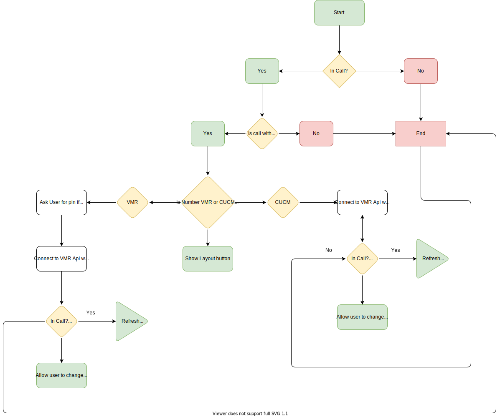

# Pexip VMR Control

**This script is to be used for controlling a Pexip VMR escalated call**

*Please note that this macro has not been fully tested and could prove to not function correctly... Use at own risk...*

*This macro was not created by a developer, therefore the code looks like a spaghetti mess thrown together*

- **Functionality**: This macro allows a user to control the layout on a by using a Pexip VMR
- **Requirements**: 
    1. Endpoint has to be registered on CUCM or be in a call with a known Pexip VMR
    2. VMR address has to be matchable using regex  

**How To**: 
1. Change PEXIP_INSTANCE_URL to point to your conferencing node
    - This conferencing node should be reachable via HTTPS from the endpoint
2. Change ESCALATEPREFIX to match your numberpattern on your VMRs
    - This matchpattern is based on regex so therefore you have to create a regex rule which will match the VMRs that the endpoint can end up in. 
    - The match will only happen on the first part of the URI, the @domain.example is split below (dont want to have to parse the domain aswell) 
    - Should the VMR not contain a pin, you can also match the search pattern here. 
3. Change VMRPREFIX to match your number pattern for your VMRs
    - This matchpattern is based on regex so therefore you have to create a regex rule which will match the VMRs that the endpoint can end up in. 
    - The match will only happen on the first part of the URI, the @domain.example is split below (dont want to have to parse the domain aswell)    

**FlowChart**

